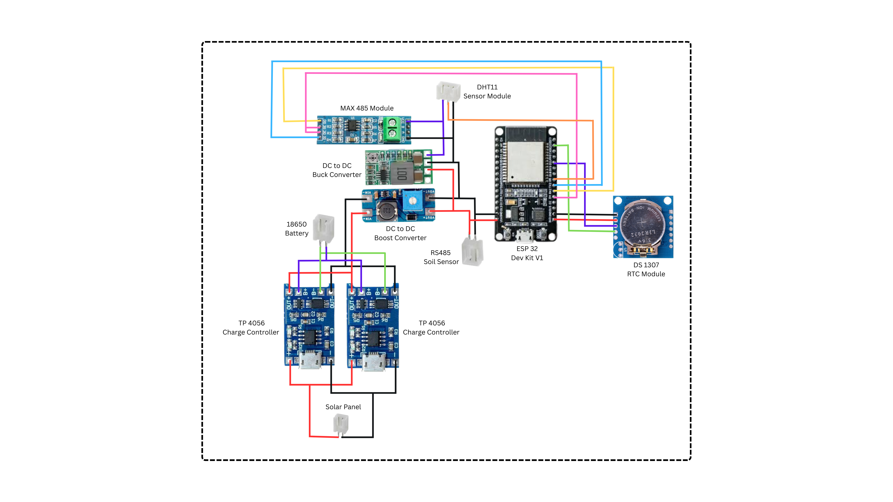

# ESP32 Soil Sensor with BLE

This project combines RS-485 soil sensors with a DHT11 humidity sensor and transmits readings via Bluetooth Low Energy (BLE). It creates a complete IoT solution for agricultural monitoring that bridges industrial sensors with modern wireless connectivity.

## Schematic Diagram

## Features

- Reads soil data (temperature, humidity, pH, NPK) from an RS-485 Modbus soil sensor
- Collects ambient humidity data from a DHT11 sensor
- Transmits all sensor readings wirelessly via BLE
- Includes Python decoder for processing received data
- Built for ESP32 microcontroller

## Hardware Requirements

- ESP32 development board
- RS-485 to TTL converter module
- Soil sensor with RS-485/Modbus RTU interface
- DHT11 temperature and humidity sensor
- DS1307 RTC module
- Power supply (3.3V)
- Connecting wires

## Data Collected

The system collects and transmits the following data:

| Parameter     | Unit     | Source       |
|---------------|----------|--------------|
| Temperature   | °C       | DHT11 Sensor |
| Soil Humidity | %RH      | Soil Sensor  |
| Conductivity  | us/cm    | Soil Sensor  |
| pH            | pH       | Soil Sensor  |
| Nitrogen      | mg/kg    | Soil Sensor  |
| Phosphorus    | mg/kg    | Soil Sensor  |
| Potassium     | mg/kg    | Soil Sensor  |
| Air Humidity  | %RH      | DHT11 Sensor |

## Communication Protocols

This project demonstrates using multiple communication protocols:

- **RS-485**: Industrial serial protocol used for soil sensor communication
- **UART**: Serial communication between ESP32 and RS-485 converter
- **I2C**:  Synchronous serial communication between ESP32 and RTC module
- **BLE**: Wireless protocol for transmitting data to mobile devices

## Installation

1. Install the Arduino IDE and add ESP32 board support
2. Install the required libraries:
   - BLEDevice (included with ESP32 board package)
   - DHT sensor library by Adafruit
   - uRTCLib library by Naguissa.
3. Compile and upload the ESP32 code to your device

## Connecting to the Device

Once the code is running on your ESP32, the device will advertise itself via BLE as "Soil Sensor". You can connect to it using:

- A mobile app that supports BLE
- A Python script using a library like `bleak` (included in this repo)
- Any BLE scanner/client application

## Troubleshooting

- No data from soil sensor: Check RS-485 wiring and ensure correct baud rate (typically 4800)
- DHT11 readings not appearing: Verify DHT11 wiring and library installation
- BLE not advertising: Check that BLE is properly initialized in setup()
