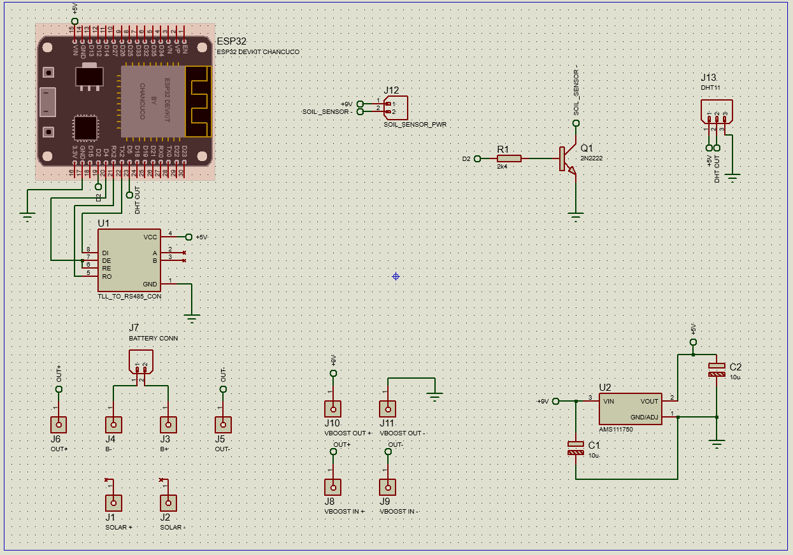
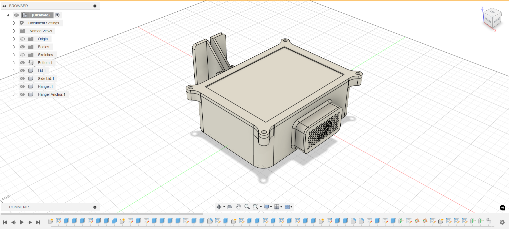

[comment]: # "This is the standard layout for the project, but you can clean this and use your own template"

# SkyT - Drone Based Crop Management System

---

## Product Introduction

SkyT is an IoT-enabled, drone-based crop management solution for tea plantations. It enables real-time field monitoring, environmental data collection, and aerial imaging, supporting early detection and data-driven decision making for improved yield and efficiency.

---

## Team
- e20032, Bandara A.M.N.C.
- e20034, Bandara G.M.M.R.
- e20157, Janakatha S.M.B.G.
- e20173, Jayasooriya P.A.S.V.

---

#### Table of Contents
1. [Introduction](#introduction)
2. [Solution Architecture](#solution-architecture)
3. [Hardware & Software Designs](#hardware-and-software-designs)
4. [Testing](#testing)
5. [Detailed Budget](#detailed-budget)
6. [Conclusion](#conclusion)
7. [Links](#links)
8. [What's New](#whats-new)

---

## Introduction

Tea plantation management faces challenges due to inefficient monitoring of vast areas. **SkyT** addresses this by leveraging drones and IoT devices for sensor data (soil quality, temperature, humidity) and high-resolution imagery, automating data collection and visualization for proactive crop management.

---

## Solution Architecture

Our architecture integrates hardware and cloud components:

**Main Components:**
- **Sensor Node:** ESP32-based unit with RS485 NPK & pH sensors, DHT11 humidity sensor, solar/battery powered, BLE-activated.
- **Drone:** Raspberry Pi-powered, captures aerial images and gathers sensor data via BLE.
- **Docking Station:** ESP32 + 4G dongle, receives data from drone via LoRa and transmits to AWS cloud.
- **Cloud Backend:** AWS-hosted, with separate Flask (IoT) and TypeScript (dashboard) backends, all data stored in MySQL.
- **Web Dashboard:** Built in React.js + Bootstrap, role-based access, real-time data and image visualization.

---

## Hardware and Software Designs

---

### Software Design
SkyT features a robust and scalable full-stack architecture with clearly separated concerns between the frontend, backend, and cloud integrations.

#### Frontend
  - Built with React, TypeScript, and Vite for a fast, modular, and modern development experience.
  - Uses Material UI (MUI) for a consistent and responsive user interface.
  - Integrates React Router DOM for protected and nested route management.
  - Includes Leaflet and Google Maps API for geospatial visualizations of estates and drone positions.
  - Utilizes MUI X Charts for real-time data visualization of environmental metrics (NPK, humidity, temperature).

#### Backend
  - Powered by Node.js + Express with TypeScript, following a modular REST API design.
  - Implements MySQL2 with connection pooling for efficient database access.
  - Features JWT-based authentication and role-based access control.
  - Deployed on AWS EC2, ensuring rapid and scalable serverless function support.
  - Handles secure file uploads, task concurrency, and drone control through integrated service hooks.
    
#### Database
  - MySQL with relational integrity and indexing for optimized queries.
  - Structured tables for estates, lots, nodes, sensor readings, images, users, and tasks.
  - Supports JSON field optimization for mapping task-lot relationships.

#### Cloud & DevOps
  - Cloudflare hosts the frontend for fast global delivery.
  - GitHub Actions automate build and deployment workflows (CI/CD).
  - Nodemailer provides email verification and notification capabilities.
  - External APIs such as AccuWeather enhance weather-based decisions.

#### Advanced Features
  - Real-time dashboard with periodic backend validation for token and session.
  - Custom middleware for authentication, error handling, and role-based permissions.
  - Image compression and secure storage with naming conventions tied to user IDs.
  - Time-series data filtering by node, date range, and value thresholds.
  - Notification system for alerts (e.g., sensor out-of-range, new image uploads).
  - Fully documented REST API endpoints and test cases using Jest + Supertest.
  - Authentication-based image accessing method.
    
 ----
  
### Hardware Design

- ESP32 sensor node with Modbus RS485 soil sensor and DHT11
- Drone integration with Pi 4 and camera module

#### Schematic Design

#### 3D Model

---

## Testing

- Backend: Automated tests using Jest + Supertest
- Manual API testing with Postman
- Hardware: Sensor and communication integration tested in field conditions

---

## Detailed Budget

| Item                      | Qty | Unit Cost | Total      |
|---------------------------|-----|-----------|------------|
| ESP32 Dev Kit             | 2   | 2000 LKR  | 4000 LKR   |
| RS485 Soil Sensor         | 1   | 11000 LKR | 11000 LKR  |
| DHT11 Humidity Sensor     | 1   | 400 LKR   | 400 LKR    |
| 3300mAh Li-Po Battery     | 2   | 3300 LKR  | 6600 LKR   |
| Drone                     | 1   | 30000 LKR | 30000 LKR  |
| Raspberry Pi Zero         | 1   | 3500 LKR  | 3500 LKR   |
| 5MP Pi Camera Module      | 1   | 2500 LKR  | 2500 LKR   |
| 32GB Storage Device       | 2   | 1790 LKR  | 3580 LKR   |
| 4G Dongle                 | 1   | 3690 LKR  | 3690 LKR   |
| Buck Converter            | 1   | 360 LKR   | 360 LKR    |
| Boost Converter           | 1   | 400 LKR   | 400 LKR    |
| Solar Panels              | 2   | 480 LKR   | 960 LKR    |
| 3D Printing               | 1   | 6200 LKR  | 6200 LKR   |
| Miscellaneous             | N/A | N/A       | 3000 LKR   |
| **SUB TOTAL**             | 14  |           | **74270 LKR** |

---

## Conclusion

SkyT has successfully reached the proof-of-concept stage, with the full data pipeline operational: from sensor/image data gathering via drone to real-time dashboard visualization. The latest improvements focus on authentication, image handling, database upgrades, and a more robust backend/frontend structure, paving the way for future automation and scalability.

---

## Links

- [Project Repository](https://github.com/cepdnaclk/e20-3yp-SkyT)
- [Project Page](https://cepdnaclk.github.io/e20-3yp-SkyT/)
- [Department of Computer Engineering](http://www.ce.pdn.ac.lk/)
- [University of Peradeniya](https://eng.pdn.ac.lk/)

---

## What's New

- **June 2025:** Project page and documentation updated ([see commit](https://github.com/cepdnaclk/e20-3yp-SkyT/commit/b38a59c0c6514657151e68866f6a1156e4b10514))
- **June 2025:** image and sensor data read/write access authentication and access control improvements
- **May 2025:** Database schema and API restructuring, improved error handling
- **May 2025:** Node packages updated, enhanced client authentication logic

_For a full commit history, see the [GitHub commits page](https://github.com/cepdnaclk/e20-3yp-SkyT/commits/main). (Note: Only the latest 10 commits are summarized here.)_

---

[//]: # (This README.md was last updated based on the latest project progress and repository commits as of June 3, 2025.)
